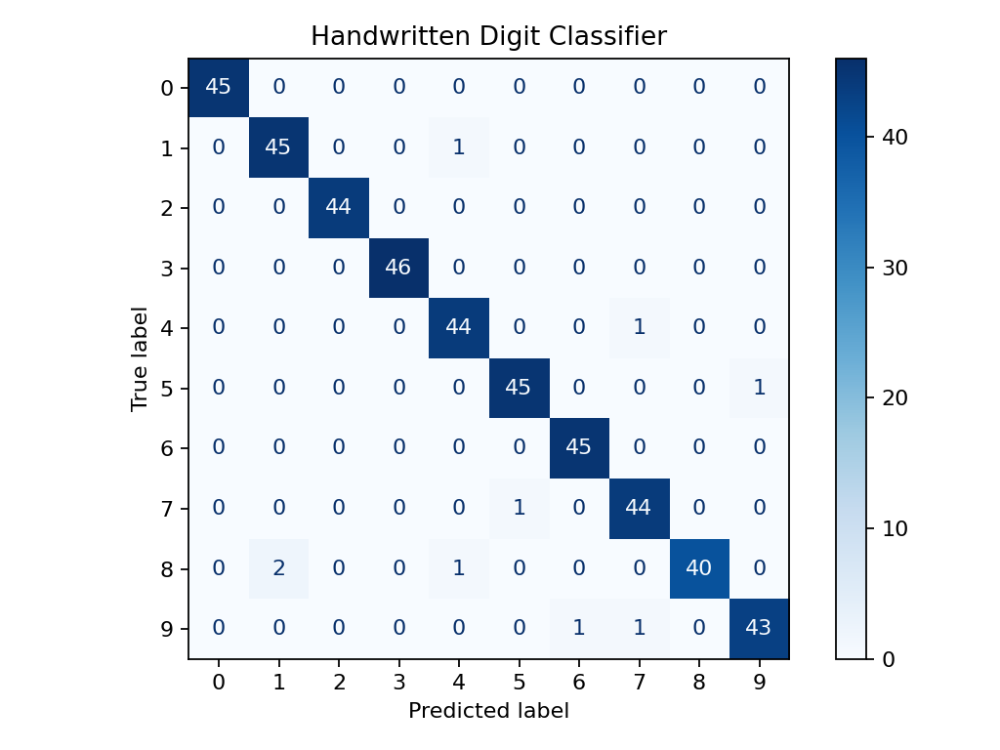

# Handwritten Digit Classifier

> **Learning material — not a completed personal portfolio project.** This repository started as AI-generated code. I have not yet independently worked through and understood the full implementation. Its code, tests and recorded metrics are not evidence of skills I can already demonstrate. I will document my own changes and explanations as I learn.

A compact computer-vision baseline that classifies handwritten digits from `0` to `9` using the scikit-learn digits dataset.

This scaffold contains an example ML workflow: load image data, split it correctly, build a pipeline, evaluate the model, save artifacts, and test the result.

## What it includes

- Built-in dataset with 1,797 labelled 8×8 images
- Standard scaling and an RBF support-vector classifier
- Accuracy and macro F1 evaluation
- Confusion-matrix image saved to `reports/`
- A command-line prediction example
- Automated tests and GitHub Actions CI

## Baseline result

The existing generated report records **98.0% accuracy** and **98.0% macro F1** on 450 held-out images. I have not independently reproduced or explained this result yet. This uses classical machine learning, not a CNN or deep-learning model.



## Run locally

```bash
python -m venv .venv
source .venv/bin/activate  # Windows: .venv\Scripts\activate
pip install -r requirements.txt
python -m src.train
python -m src.predict --sample-index 42
```

The training command creates:

- `artifacts/digit_classifier.joblib`
- `reports/metrics.json`
- `reports/confusion_matrix.png`

## Why this model?

The dataset is small, so an SVC provides a classical baseline. A useful next step would be to compare it with a small neural network or CNN on a larger image dataset.

## Next steps

- Add an interactive image-upload interface
- Compare SVC, k-nearest neighbours, and neural-network baselines
- Test robustness on rotated or noisy images
